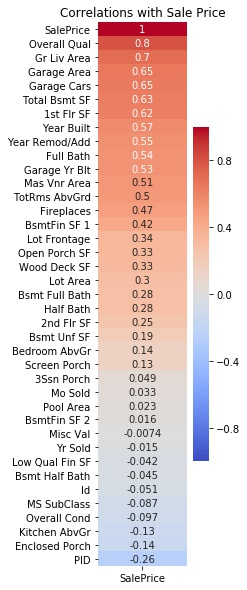
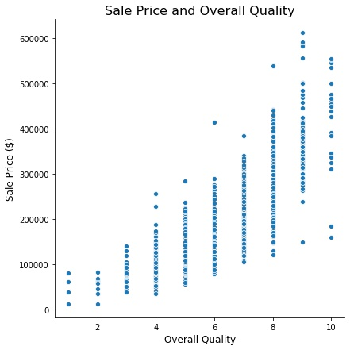
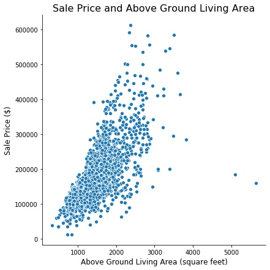
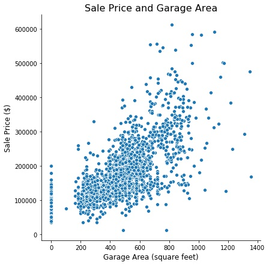
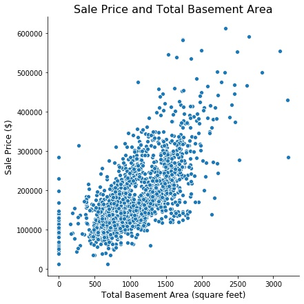
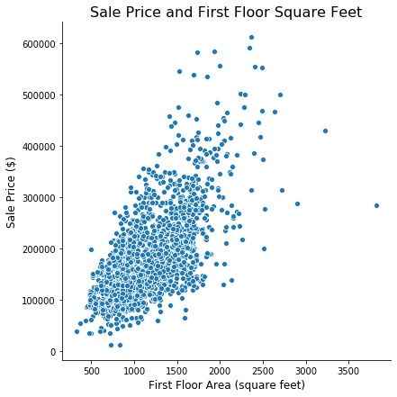
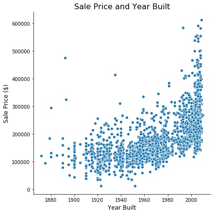
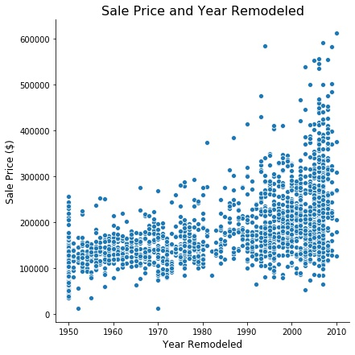
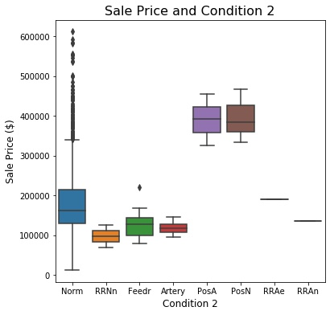
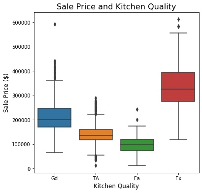

# Predicting Housing Prices in Ames, Iowa
### January 17, 2020
### Lisa Hwang

### Objective
 The goal of this project was to review Ames housing data and build a model that would be able to predict housing sale prices.

### Repo Contents
- 01_EDA: Jupyter Notebook outlining EDA process
- 02_LogisticRegression: Jupyter Notebook outlining modeling
- 03_Regularization: Jupyter Notebook outlining regularization
- Dataset: Folder containing data in CSV files
- Images: Folder containing visualizations

### Dataset
The dataset contained information originally obtained from the Ames Assessor’s Office. It included nearly 80 variables used in computing assessed values for individual residential properties. These properties were sold in Ames, IA from 2006 to 2010. The dataset included data for 2,051 properties.

Some variables were:
 - Year built
 - Garage type
 - Central air
 - Neighborhood
 - Lot shape

The data dictionary and additional information on the dataset can be found here: [http://jse.amstat.org/v19n3/decock/DataDocumentation.txt](http://jse.amstat.org/v19n3/decock/DataDocumentation.txt)

-   [train.csv](Datasets/train.csv)
Contains 2051 rows and 81 columns
- [test.csv](Datasets/test.csv)
Contains 878 rows and 80 columns (sale prices removed)

Each dataset was reviewed for missing values, correct datatypes, and entry errors. Rows containing nulls were dropped from the dataset.

### Variable Selection
Correlations between variables and sale price were generated, and those with  stronger correlations to the sale price were examined. Twelve variables had positive correlations of 0.5 or higher. Overall quality had the strongest correlation, at 0.80.

### Variables Selected for Linear Regression Model
|Variable Name |Description  |
|--|--|
| Overall Qual | overall quality
| Gr Liv Area | above ground living area
| Garage Area | garage area
| Total Bsmt SF | total basement square feet
 |1st Flr SF | first floor square feet
|Year Built | year built
|Year Remod/Add | year remodeled or addition built
 |Condition 2_Feedr | proximity to condition (adjacent to feeder street)
|Condition 2_Norm | proximity to condition (normal)
 |Condition 2_PosA | proximity to condition (adjacent to postive off-site feature such as park, greenbelt)
 |Kitchen Qual_Fa | kitchen quality (fair)
 |Kitchen Qual_Gd | kitchen quality (good)
| Kitchen Qual_TA | kitchen quality (typical/average)

#### Variable: Overall Quality
 - Overall quality ratings were on a scale of 1 to 10:
-  10: Very excellent
-  9:	Excellent
-   8:  Very Good
-   7:	Good
-   6:	Above Average
-   5:	Average
-  4:	Below Average
-  3:	Fair
-  2:	Poor
-   1: Very poor

- A general trend was seen; as overall quality ratings increased toward 10, sale prices increased

#### Variable: Gr Liv Area
##### Above ground living area
-   Ranged from 334 to 5642 square feet
-   2 outliers were reviewed and removed from the dataset
- A general trend was seen; as above ground living area increased in size, sale prices increased

#### Variable: Garage Area
 - Continuous variable
 - Ranged from 0 to 1418 square feet
 - A general trend was seen; as garage area increased in size, sale prices increased

#### Variable: Total Bsmt SF
##### Total basement square feet
- Continuous variable
- Ranged from 0 to 6110 square feet
- A general trend was seen; as basement area increased in size, sale prices increased

 

#### Variable: 1st Flr SF
##### First floor square feet
 - Continuous variable
 - Ranged from 334 to 5095 square feet
 - A general trend was seen; as first floor square feet increased in size, sale prices increased

#### Variable: Year Built
 - Ranged from 1872 to 2010
 - A general trend was seen; as years became more current, sale prices increased

#### Variable: Year Remod/Add
##### Year remodeled or addition built
 - Ranged from 1950 to 2010
 - A general trend was seen; as the year remodeling took place became more current, sale prices increased

#### Variable: Condition 2_Feedr
##### Proximity to condition (adjacent to feeder street)

#### Variable: Condition 2_Norm
##### Proximity to condition (normal)

#### Variable: Condition 2_PosA
##### Proximity to condition (adjacent to positive off-site feature such as park, greenbelt)

 - Categorical variable
 - Dummy columns created for analysis
 - Other options included
	 - Artery: Adjacent to arterial street
	 - RRNn: Within 200' of North-South Railroad
     - RRAn: Adjacent to North-South Railroad
     - PosN: Near positive off-site feature--park, greenbelt, etc.
     - RRNe: Within 200' of East-West Railroad
     - RRAe: Adjacent to East-West Railroad

- Possible strong relationship with price, less overlap among categories

  

#### Variable: Kitchen Qual_Fa
##### Kitchen quality (fair)

#### Variable: Kitchen Qual_Gd
##### Kitchen quality (good)

#### Variable: Kitchen Qual_TA
##### Kitchen quality (typical/average)
 - Categorical variable
 - Dummy columns created for analysis
 - Options to be assigned to variable:
	 - Ex: Excellent
	 - Gd: Good
     - TA: Typical/Average
     - Fa: Fair
     - Po: Poor
 - Possible strong relationship with price, less overlap among categories

  

### Linear Regression Model
A train-test-split was performed on the train dataset before cross validation scores (Rsquared values) were generated using 5 folds:

    array([0.8509308 , 0.84056879, 0.85040171, 0.85963686, 0.84803333])

The average score was 0.8499, and the individual scores were similar to each other. This suggested that the model isn't being distorted by outliers, if any exist, and that consistent results are being obtained with each fold.

Then the linear regression model was fit and Rsquared scores obtained for the train data and the test data.
-   Rsquared training: 0.8564
-   Rsquared test: 0.8581

The model's cross validation score, train score, and test score were all similar and relatively high. This was an indication of a strong model.

### LASSO Model
The regularization technique LASSO was performed after polynomial features were added and data were scaled. A total of 945 variables were included initially but reduced to 99 in the model.

The model scored well on both training data and test data:
-   Rsquared training: 0.9422  
-   Rsquared test: 0.9243

Some of the variables with the highest positive or negative coefficients were the following:

|Variable Name|Coefficient  |
|--|--|
| Overall Qual Gr Liv Area|25067.523471
| Overall Qual Total Bsmt SF|7682.779906
| Overall Qual BsmtFin SF 1|6780.320160
| Overall Qual Garage Area|6194.459004
| Year Built Year Remod/Add|6161.600930

### Ridge Model
The ridge model scored well on training data though not as well on test data, indicating some overfitting.
-   Rsquared training: 0.9642
-   Rsquared test: 0.8863

Some of the features with the highest positive and negative coefficients were the following:

| Feature | Coefficient |
|--|--|
| Full Bath Kitchen Qual_Fa|-9276.675893
| Overall Qual^2 |  9041.445821|
|Overall Qual Gr Liv Area|8853.650866
|Overall Qual 1st Flr SF|8815.124767
| MS SubClass TotRms AbvGrd|-8345.021544

### Conclusions
A successful linear regression model was created for predicting Ames housing sale prices. The following variables were used:
-   Overall quality
-   Above ground living area
-   Garage area
-   Total basement square feet
-   First floor square feet
-   Year built
-   Year remodeled or addition built
-   Condition 2: adjacent to feeder street
-   Condition 2: normal
-   Condition 2: adjacent to positive off-site feature such as park, greenbelt)
-   Kitchen quality (fair)
-   Kitchen quality (good)
-   Kitchen quality (typical/average)

This model performed well on both data used to create the model and on unseen data.

Additional LASSO regularization modeling suggested the following variables and others are not as important to sale prices:
-   Type of dwelling in the sale
-   Basement half bathrooms
-   Masonry veneer area in square feet

### Possible Future Directions
-   Continue to refine model by adding and subtracting variables   
-   Investigate possible outliers in the dataset and their causes
-   Examine if model performs well on housing data from other cities
